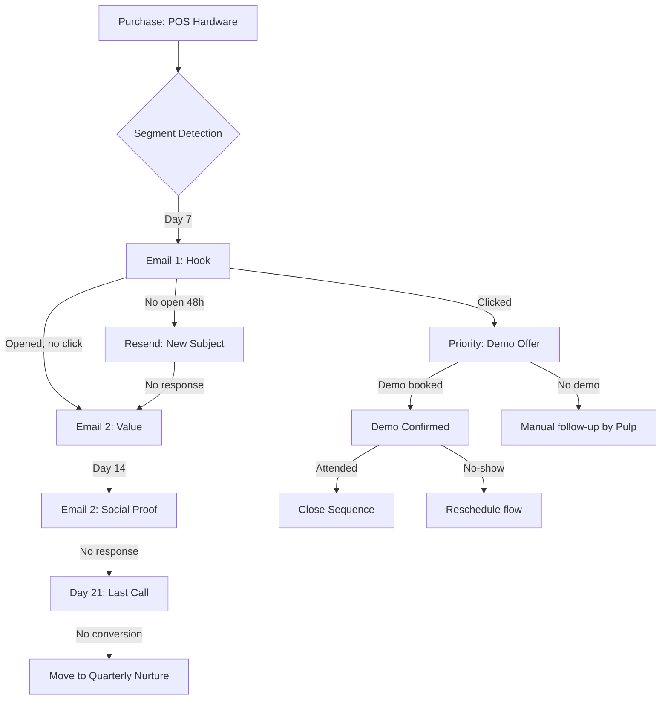
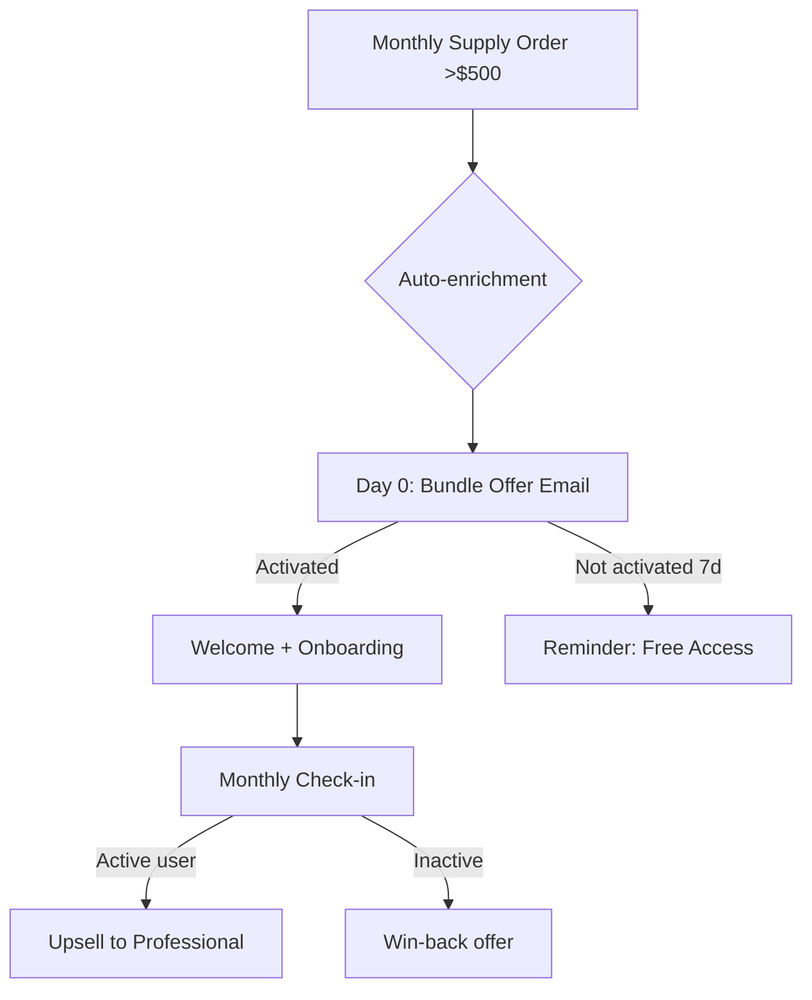
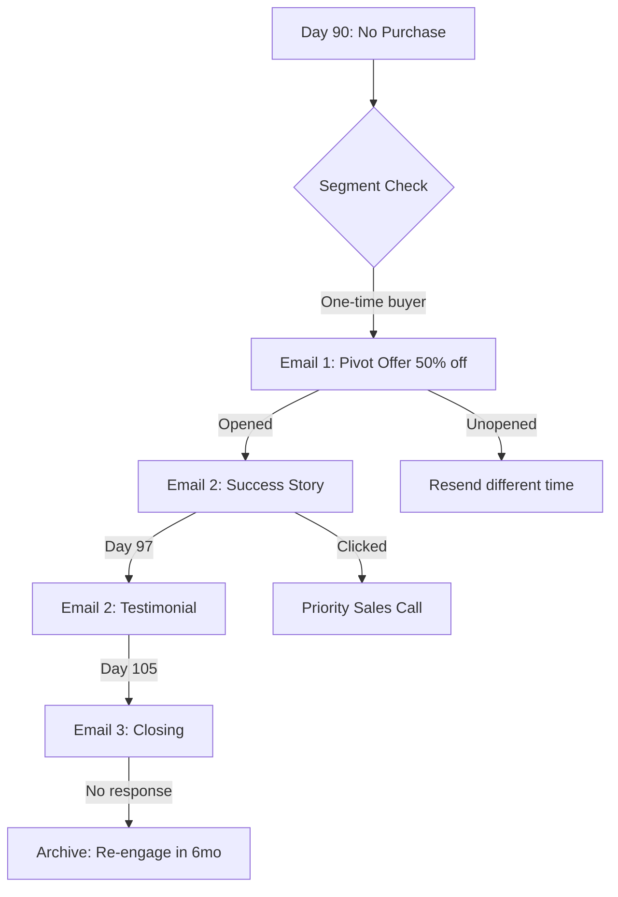
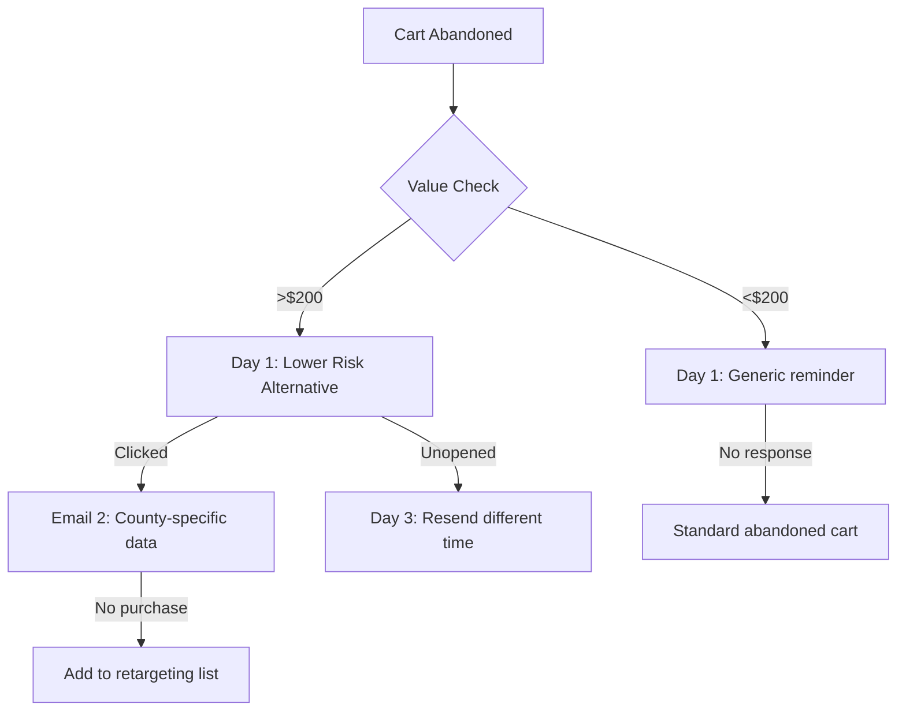

# DataDepot - A/B Testing Framework & Automation Triggers
## Email Optimization & Automated Sequences

---

## A/B Testing Framework

### Test Variables Matrix

| Element | Variation A | Variation B | Variation C | Primary Metric |
|---------|-------------|-------------|-------------|----------------|
| **Subject Line** | Question format | Benefit format | Curiosity/Urgency | Open Rate |
| **Preview Text** | Personal stat | Social proof | Pain point | Open Rate |
| **CTA Button** | "Get 50 Free Leads" | "See Sample Data" | "Start Free Trial" | Click Rate |
| **Sender Name** | Miles (personal) | DataDepot Team | Performance Supply Depot | Open Rate |
| **Email Length** | Short (150 words) | Medium (250 words) | Long (400 words) | Reply Rate |
| **Social Proof** | Competitor intel | Customer testimonial | ROI calculation | Click Rate |
| **Send Time** | 8 AM PT | 12 PM PT | 4 PM PT | Open Rate |
| **Send Day** | Tuesday | Wednesday | Thursday | Open Rate |

---

## Current A/B Test Queue

### TEST #1: Subject Line (Segment A - Hardware Buyers)

**Email:** Day 1 - Hardware-to-Leads Bridge

| Variant | Subject | Hypothesis | Segment Size |
|---------|---------|------------|--------------|
| **A** | `{{First_Name}}, your {{Product_Name}} + 500 qualified leads ready` | Personal + specific benefit | 50% |
| **B** | `{{First_Name}}, competitors in {{County}} know something you don't` | Curiosity gap | 50% |

**Duration:** 7 days (until 100 sends complete)  
**Success Metric:** Open rate  
**Winner Threshold:** 8%+ absolute difference

### TEST #2: Send Time (All Segments)

| Time Slot | Sends | Hypothesis |
|-----------|-------|------------|
| 8:00 AM PT | 33% | Early birds check email first |
| 12:00 PM PT | 33% | Lunch break opens |
| 4:00 PM PT | 33% | End-of-day check |

**Duration:** 14 days  
**Success Metric:** Combined open + click rate

### TEST #3: CTA Wording (Landing Page → Email)

| Variant | CTA Text | Hypothesis |
|---------|----------|------------|
| A | "Get 50 Free Sample Leads" | Direct value |
| B | "View Sample Data Now" | Lower friction |
| C | "See Which Restaurants Need POS" | Problem-focused |

**Duration:** 14 days  
**Success Metric:** Click-through rate

### TEST #4: Email Length (Day 1 Sequence)

| Variant | Word Count | Hypothesis |
|---------|------------|------------|
| A | Short (120 words) | Busy buyers skim |
| B | Medium (250 words) | Need context to convert |

**Duration:** 21 days  
**Success Metric:** Reply rate

---

## Test Result Tracking

```json
{
  "test_id": "subject_hardware_day1_20260429",
  "start_date": "2026-04-29",
  "end_date": "2026-05-06",
  "status": "running",
  "segments": ["segment_a_hardware"],
  "variable": "subject_line",
  "variants": {
    "A": {
      "text": "{{First_Name}}, your {{Product_Name}} + 500 qualified leads ready",
      "sends": 0,
      "opens": 0,
      "clicks": 0,
      "replies": 0,
      "open_rate": 0,
      "click_rate": 0,
      "reply_rate": 0
    },
    "B": {
      "text": "{{First_Name}}, competitors in {{County}} know something you don't",
      "sends": 0,
      "opens": 0,
      "clicks": 0,
      "replies": 0,
      "open_rate": 0,
      "click_rate": 0,
      "reply_rate": 0
    }
  },
  "winner": null,
  "confidence": 0
}
```

---

## Automation Trigger System

### Trigger Map

```
TRIGGER CONDITIONS
│
├── STRIPE WEBHOOK EVENTS
│   ├── checkout.session.completed
│   │   ├── product_category = "pos_systems" → Segment A (7-day delay)
│   │   ├── product_category = "paper_products" → Segment B (0-day, bundle)
│   │   ├── product_category = "ink_ribbons" → Segment B (0-day, bundle)
│   │   └── order_count = 1 → Tag as "one_time_buyer" (90-day win-back)
│   │
│   ├── invoice.paid (recurring)
│   │   └── order_count > 2 → Update "supply_recurring" status
│   │
│   └── charge.failed
│       └── Cart abandoned → Segment D (24-hour delay)
│
├── TIME-BASED TRIGGERS
│   ├── Day 7 post-purchase (hardware) → Email 1 (Segment A)
│   ├── Day 14 (no response) → Email 2 (Segment A)
│   ├── Day 21 (no response) → Email 3 (Segment A)
│   ├── Day 90 no purchase → Email 1 (Segment C - Win-back)
│   ├── Monthly supply shipment → Email 1 (Segment B)
│   └── 24-hour cart abandonment → Email 1 (Segment D)
│
├── BEHAVIORAL TRIGGERS
│   ├── Email opened, no click → Resend with new subject (48h)
│   ├── Email opened, clicked → Fast-track to sales (12h)
│   ├── Email unopened → Resend different time slot (72h)
│   ├── Landing page visit, no form → Retargeting pixel
│   ├── Form submitted, no purchase → Follow-up Email (24h)
│   └── Sample downloaded → Sales call scheduled (auto)
│
└── MANUAL TRIGGERS
    ├── Sales rep adds note → Pause automated sequence
    ├── Customer replies → Stop automation, notify Pulp
    └── Demo booked → Start nurture sequence (case studies)
```

---

## Automation Sequence Flows

### SEQUENCE A: Hardware Buyers (7-14-21 Day)



### SEQUENCE B: Supply Recurring (Monthly)



### SEQUENCE C: Win-Back (90-97-105 Day)



### SEQUENCE D: Abandoned Cart (24-72 Hour)



---

## Email Decision Engine

```python
# automation_decision_engine.py

class EmailDecisionEngine:
    """
    Determines which email to send based on customer state
    """
    
    def __init__(self):
        self.rules = self._load_rules()
    
    def evaluate_customer(self, customer_id, stripe_data):
        """
        Main decision entry point
        Returns: email_to_send, delay_hours, priority
        """
        state = self._build_customer_state(customer_id, stripe_data)
        
        # Priority 1: Check for recent activity
        if state['recent_demo_booked']:
            return None, 0, 'PAUSE'  # Don't send, sales handling
        
        if state['recent_reply']:
            return None, 0, 'PAUSE'  # Don't send, reply manually
        
        # Priority 2: Check for sequence in progress
        if state['active_sequence']:
            next_email = self._get_next_sequence_email(state)
            return next_email, self._calculate_delay(state), 'NORMAL'
        
        # Priority 3: Evaluate triggers for new sequence
        if state['days_since_purchase'] == 7 and state['segment'] == 'A':
            return 'segment_a_email_1', 0, 'HIGH'
        
        if state['days_since_purchase'] == 90 and state['order_count'] == 1:
            return 'segment_c_email_1', 0, 'MEDIUM'
        
        if state['cart_abandoned'] and state['hours_since_abandon'] >= 24:
            return 'segment_d_email_1', 0, 'LOW'
        
        # Priority 4: Behavioral triggers
        if state['email_opened'] and not state['email_clicked'] and state['hours_since_open'] >= 48:
            return 'followup_value_focus', 0, 'MEDIUM'
        
        return None, 0, 'NO_ACTION'
    
    def _build_customer_state(self, customer_id, stripe_data):
        """Aggregate all customer data into decision state"""
        metadata = stripe_data.get('metadata', {})
        
        return {
            'customer_id': customer_id,
            'segment': metadata.get('customer_segment', 'unknown'),
            'days_since_purchase': int(metadata.get('days_since_last_order', 999)),
            'order_count': int(metadata.get('order_count', 0)),
            'cart_abandoned': metadata.get('cart_abandoned', 'false') == 'true',
            'hours_since_abandon': self._calc_abandon_hours(metadata),
            'active_sequence': metadata.get('active_sequence', ''),
            'last_email_sent': metadata.get('cross_sell_email_1_sent', ''),
            'last_email_opened': metadata.get('cross_sell_email_1_opened', 'false') == 'true',
            'last_email_clicked': metadata.get('cross_sell_email_1_clicked', 'false') == 'true',
            'hours_since_open': self._calc_hours_since(metadata.get('last_open_time', '')),
            'recent_demo_booked': self._check_recent_demo(customer_id),
            'recent_reply': self._check_recent_reply(customer_id),
            'data_depot_status': metadata.get('data_depot_status', 'prospect'),
        }
```

---

## Webhook Automation Handler

```python
# webhook_automation_handler.py

from flask import Flask, request
import stripe
from datetime import datetime, timedelta

app = Flask(__name__)

decision_engine = EmailDecisionEngine()
email_queue = EmailQueue()  # Interface to Mailgun/SendGrid

@app.route('/stripe-automation', methods=['POST'])
def handle_stripe_automation():
    """
    Stripe webhook handler that triggers automation sequences
    """
    event = stripe.Webhook.construct_event(
        request.data,
        request.headers.get('Stripe-Signature'),
        webhook_secret
    )
    
    if event['type'] == 'checkout.session.completed':
        handle_purchase_completion(event['data']['object'])
    
    elif event['type'] == 'charge.failed':
        handle_cart_abandonment(event['data']['object'])
    
    return {'status': 'processed'}, 200

def handle_purchase_completion(session):
    """Route to appropriate sequence based on purchase"""
    customer_id = session['customer']
    
    # Get enriched customer data
    customer = stripe.Customer.retrieve(customer_id)
    
    # Determine sequence
    segment = customer.metadata.get('customer_segment', '')
    
    if segment == 'hardware_buyer':
        # Schedule 7-day delay
        queue_sequence(customer_id, 'segment_a_hardware', delay_days=7)
        
    elif segment == 'supply_recurring':
        # Immediate with shipment
        queue_sequence(customer_id, 'segment_b_supply', delay_days=0)
        
    elif segment == 'one_time_buyer':
        # Schedule 90-day win-back
        queue_sequence(customer_id, 'segment_c_winback', delay_days=90)

def queue_sequence(customer_id, sequence_name, delay_days=0):
    """Add customer to email sequence queue"""
    scheduled_time = datetime.now() + timedelta(days=delay_days)
    
    email_queue.add({
        'customer_id': customer_id,
        'sequence': sequence_name,
        'scheduled_time': scheduled_time.isoformat(),
        'status': 'scheduled',
        'created_at': datetime.now().isoformat()
    })
    
    # Update customer metadata
    stripe.Customer.modify(customer_id, metadata={
        'active_sequence': sequence_name,
        'sequence_scheduled': scheduled_time.isoformat(),
    })

# Cron job processes queue every hour
# /etc/cron.d/datadepot-emails
# 0 * * * * root /usr/bin/python3 /datadepot/process_email_queue.py
```

---

## Cron Schedule for Automated Sending

```bash
# datadepot_cron_schedule.txt

# Process email queue every hour
0 * * * * root /usr/bin/python3 /root/.openclaw/workspace/datadepot/cron/process_queue.py >> /var/log/datadepot/emails.log 2>&1

# Daily data collection (Patricia)
0 6 * * * root /usr/bin/python3 /root/.openclaw/workspace/datadepot/cron/daily_collection.py >> /var/log/datadepot/collection.log 2>&1

# Weekly A/B test analysis (Monday 9 AM)
0 9 * * 1 root /usr/bin/python3 /root/.openclaw/workspace/datadepot/cron/ab_test_analysis.py >> /var/log/datadepot/ab_tests.log 2>&1

# Weekly sales sprint review (Monday 9:30 AM)
30 9 * * 1 root /usr/bin/python3 /root/.openclaw/workspace/datadepot/cron/weekly_sprint.py >> /var/log/datadepot/sprint.log 2>&1

# Daily health check (8 AM)
0 8 * * * root /usr/bin/python3 /root/.openclaw/workspace/datadepot/cron/health_check.py >> /var/log/datadepot/health.log 2>&1

# Nightly email statistics rollup (11 PM)
0 23 * * * root /usr/bin/python3 /root/.openclaw/workspace/datadepot/cron/daily_stats.py >> /var/log/datadepot/stats.log 2>&1
```

---

## A/B Test Winner Selection Logic

```python
# ab_test_winner.py

import math
from scipy import stats

def select_winner(test_data, min_confidence=0.95, min_samples=100):
    """
    Determine A/B test winner using statistical significance
    """
    variant_a = test_data['variants']['A']
    variant_b = test_data['variants']['B']
    
    # Check minimum sample size
    if variant_a['sends'] < min_samples or variant_b['sends'] < min_samples:
        return {'status': 'insufficient_data', 'winner': None}
    
    # Calculate rates
    rate_a = variant_a['opens'] / variant_a['sends']
    rate_b = variant_b['opens'] / variant_b['sends']
    
    # Two-proportion z-test
    successes = [variant_a['opens'], variant_b['opens']]
    totals = [variant_a['sends'], variant_b['sends']]
    
    z_stat, p_value = sm.stats.proportions_ztest(successes, totals)
    
    confidence = 1 - p_value
    
    if confidence >= min_confidence:
        winner = 'A' if rate_a > rate_b else 'B'
        lift = abs(rate_a - rate_b) / min(rate_a, rate_b) * 100
        
        return {
            'status': 'winner_found',
            'winner': winner,
            'confidence': confidence,
            'lift_percentage': lift,
            'rate_a': rate_a,
            'rate_b': rate_b,
            'recommendation': f"Use Variant {winner} (Lift: {lift:.1f}%)"
        }
    else:
        return {
            'status': 'inconclusive',
            'winner': None,
            'confidence': confidence,
            'needed_samples': estimate_needed_samples(variant_a, variant_b, min_confidence)
        }
```

---

## Dashboard Metrics to Track

### Real-Time Metrics (Updated Hourly)
- Emails in queue
- Emails sent (last 24h)
- Open rate (rolling 7d)
- Click rate (rolling 7d)
- Reply rate (rolling 7d)
- Demo bookings from email
- Conversions to paid

### A/B Test Metrics (Updated Daily)
- Active test count
- Test completion status
- Winner confidence levels
- Recommended optimizations

### Sequence Performance (Updated Weekly)
- Sequence completion rates
- Drop-off points
- Revenue per sequence
- Best performing segments

---

**Next Steps:**
1. Deploy webhook handler to `/stripe-automation`
2. Create cron jobs for queue processing
3. Start Test #1 (Subject lines)
4. Connect email sending API (Mailgun/SendGrid)

**Last Updated:** 2026-04-29
**Status:** Ready for Implementation
