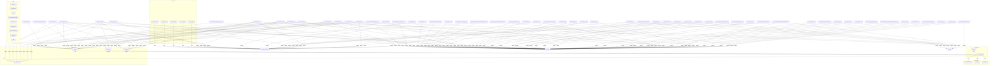

# Knowledge Graph Visualization

```mermaid
graph TB

    subgraph Core Systems
        sys_brain_v45[Brain v4.5]
        sys_bhsi_v4[BHSI v4]
    end

    subgraph Biological Pipeline
        sys_thyroid[Thyroid v1.2]
        sys_liver[Liver v1.0]
        sys_kidneys[Kidneys v1.0]
        sys_lungs[Lungs v1.0]
    end

    subgraph Society Agents
        agent_patricia_factory[Patricia Factory]
        agent_forge_factory[Forge Factory]
        agent_chelios_security[Chelios Security]
        agent_jordan_office[Jordan Office]
        agent_aurora_tasks[Aurora Tasks]
    end

    subgraph Skills
        skill_depotchaos[Depotchaos]
        skill_browser_agent[Browser Agent]
        skill_cmp[Cmp]
        skill_agent_browser_clawdbot[Agent Browser Clawdbot]
        skill_email_sender[Email Sender]
        skill_game_creator[Game Creator]
        skill_browser_automation[Browser Automation]
        skill_skill_builder[Skill Builder]
        skill_audit[Audit]
    end

    subgraph External APIs
        int_ollama[Ollama/Mortimer]
        int_sendgrid[SendGrid]
        int_hostinger[Hostinger]
    end

    sys_bhsi_v4 -->|feeds| sys_brain_v45
    sys_liver -->|filters| sys_brain_v45
    sys_brain_v45 -->|drains| sys_kidneys
    sys_lungs -->|oxygenates| sys_brain_v45
    sys_thyroid -->|regulates| sys_brain_v45
    agent_patricia_factory -->|uses| sys_mission_control
    agent_forge_factory -->|uses| sys_mission_control
    agent_chelios_security -->|uses| sys_mission_control
    agent_jordan_office -->|uses| sys_mission_control
    agent_aurora_tasks -->|uses| sys_mission_control
    sys_brain_v45 -->|connects| int_ollama
    sys_brain_v45 -->|connects| int_sendgrid
    sys_brain_v45 -->|connects| int_hostinger
    mem_ai_agent_implementation_plan -->|mentions| sys_brain
    mem_2026_04_15 -->|mentions| sys_brain
    mem_2026_04_15 -->|mentions| sys_mission_control
    mem_2026_04_15 -->|mentions| sys_liver
    mem_2026_06_30_midnight_push -->|mentions| sys_brain
    mem_2026_04_19 -->|mentions| sys_brain
    mem_2026_04_19 -->|mentions| sys_bhsi
    mem_2026_04_19 -->|mentions| sys_mission_control
    mem_2026_04_19 -->|mentions| sys_thyroid
    mem_2026_04_19 -->|mentions| sys_liver
    mem_2026_04_19 -->|mentions| sys_kidneys
    mem_2026_04_19 -->|mentions| sys_lungs
    mem_2026_07_15 -->|mentions| sys_liver
    mem_element_analysis_2026_03_31 -->|mentions| sys_brain
    mem_element_analysis_2026_03_31 -->|mentions| sys_liver
    mem_2026_06_13 -->|mentions| sys_brain
    mem_2026_07_22_midnight_push -->|mentions| sys_brain
    mem_2026_03_30 -->|mentions| sys_brain
    mem_2026_07_16_evening_push -->|mentions| sys_brain
    mem_PIPELINE_POST_MORTEM_2026_06_02 -->|mentions| sys_brain
    mem_monthly_audit_2026_03 -->|mentions| sys_brain
    mem_2026_06_15 -->|mentions| sys_brain
    mem_2026_06_15 -->|mentions| sys_mission_control
    mem_2026_06_15 -->|mentions| sys_liver
    mem_2026_06_15 -->|mentions| sys_kidneys
    mem_2026_04_07 -->|mentions| sys_brain
    mem_2026_04_07 -->|mentions| sys_mission_control
    mem_2026_04_07 -->|mentions| sys_thyroid
    mem_2026_04_07 -->|mentions| sys_liver
    mem_2026_04_07 -->|mentions| sys_kidneys
    mem_2026_03_27 -->|mentions| sys_brain
    mem_2026_04_09 -->|mentions| sys_brain
    mem_2026_04_09 -->|mentions| sys_mission_control
    mem_2026_04_09 -->|mentions| sys_thyroid
    mem_2026_07_14 -->|mentions| sys_brain
    mem_2026_07_14 -->|mentions| sys_mission_control
    mem_2026_03_15 -->|mentions| sys_brain
    mem_2026_03_15 -->|mentions| sys_liver
    mem_PHASE1_STATUS_REPORT -->|mentions| sys_liver
    mem_2026_04_21 -->|mentions| sys_brain
    mem_2026_04_21 -->|mentions| sys_mission_control
    mem_2026_04_08 -->|mentions| sys_brain
    mem_2026_04_08 -->|mentions| sys_mission_control
    mem_2026_04_08 -->|mentions| sys_thyroid
    mem_2026_04_08 -->|mentions| sys_liver
    mem_2026_04_08 -->|mentions| sys_kidneys
    mem_2026_04_08 -->|mentions| sys_lungs
    mem_2026_07_14_morning_push -->|mentions| sys_brain
    mem_2026_05_19 -->|mentions| sys_brain
    mem_2026_03_17 -->|mentions| sys_brain
    mem_2026_06_10 -->|mentions| sys_brain
    mem_2026_04_02 -->|mentions| sys_brain
    mem_2026_04_02 -->|mentions| sys_bhsi
    mem_2026_04_02 -->|mentions| sys_mission_control
    mem_2026_07_02_evening_push -->|mentions| sys_brain
    mem_2026_06_27 -->|mentions| sys_brain
    mem_2026_06_25 -->|mentions| sys_brain
    mem_2026_04_29 -->|mentions| sys_brain
    mem_2026_04_29 -->|mentions| sys_bhsi
    mem_2026_04_29 -->|mentions| sys_mission_control
    mem_2026_06_05 -->|mentions| sys_brain
    mem_2026_04_28 -->|mentions| sys_brain
    mem_2026_04_28 -->|mentions| sys_bhsi
    mem_2026_04_28 -->|mentions| sys_mission_control
    mem_2026_04_27 -->|mentions| sys_brain
    mem_2026_04_27 -->|mentions| sys_bhsi
    mem_2026_04_27 -->|mentions| sys_mission_control
    mem_2026_03_31_brain_stall_alert -->|mentions| sys_brain
    mem_2026_06_29_evening_push -->|mentions| sys_brain
    mem_2026_06_11 -->|mentions| sys_brain
    mem_2026_06_11 -->|mentions| sys_liver
    mem_2026_06_06 -->|mentions| sys_brain
    mem_factory_queue_2026_03_31 -->|mentions| sys_brain
    mem_2026_03_31 -->|mentions| sys_brain
    mem_2026_06_29_morning_push -->|mentions| sys_brain
    mem_2026_04_17 -->|mentions| sys_brain
    mem_2026_04_17 -->|mentions| sys_mission_control
    mem_2026_04_17 -->|mentions| sys_thyroid
    mem_2026_04_17 -->|mentions| sys_liver
    mem_2026_04_17 -->|mentions| sys_kidneys
    mem_2026_04_17 -->|mentions| sys_lungs
    mem_2026_06_28 -->|mentions| sys_brain
    mem_2026_06_16 -->|mentions| sys_brain
    mem_2026_04_04 -->|mentions| sys_brain
    mem_2026_04_04 -->|mentions| sys_mission_control
    mem_2026_04_22 -->|mentions| sys_brain
    mem_2026_04_22 -->|mentions| sys_bhsi
    mem_2026_04_22 -->|mentions| sys_mission_control
    mem_2026_04_22 -->|mentions| sys_thyroid
    mem_2026_04_22 -->|mentions| sys_liver
    mem_2026_04_22 -->|mentions| sys_kidneys
    mem_2026_04_06 -->|mentions| sys_brain
    mem_2026_04_06 -->|mentions| sys_liver
    mem_2026_04_06 -->|mentions| sys_kidneys
    mem_2026_03_16 -->|mentions| sys_brain
    mem_2026_06_30_evening_push -->|mentions| sys_brain
    mem_2026_04_10_APK_iOS_SEARCH_RESULTS -->|mentions| sys_brain
    mem_exec_team_openclaw_optimization_2026 -->|mentions| sys_brain
    mem_exec_team_openclaw_optimization_2026 -->|mentions| sys_bhsi
    mem_exec_team_openclaw_optimization_2026 -->|mentions| sys_mission_control
    mem_2026_07_21 -->|mentions| sys_brain
    mem_2026_07_21 -->|mentions| sys_mission_control
    mem_2026_04_05 -->|mentions| sys_brain
    mem_2026_04_05 -->|mentions| sys_mission_control
    mem_2026_04_05 -->|mentions| sys_thyroid
    mem_2026_04_05 -->|mentions| sys_liver
    mem_2026_04_05 -->|mentions| sys_kidneys
    mem_2026_07_11 -->|mentions| sys_brain
    mem_2026_06_04 -->|mentions| sys_brain
    mem_2026_06_26_evening_push -->|mentions| sys_brain
    mem_2026_03_29 -->|mentions| sys_brain
    mem_2026_03_18 -->|mentions| sys_brain
    mem_monthly_audit_2026_04 -->|mentions| sys_brain
    mem_monthly_audit_2026_04 -->|mentions| sys_bhsi
    mem_factory_queue_updated_2026_06_01 -->|mentions| sys_brain
    mem_factory_queue_updated_2026_06_01 -->|mentions| sys_liver
```

## Statistics

| Metric | Count |
|--------|-------|
| Nodes | 100 |
| Edges | 129 |
| Systems | 2 |
| Agents | 0 |
| Skills | 9 |
